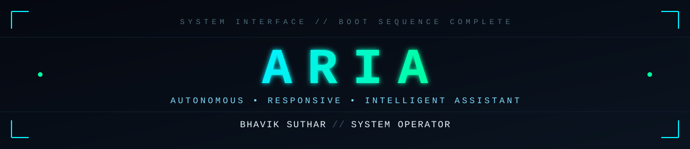
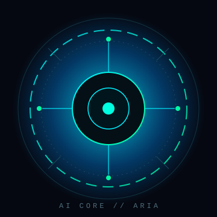

<div align="center">



<br/>


</div>


## `[ 02 ]` SYSTEM STATUS

<div align="center">

| MODULE | STATUS |
|:--|:--:|
| **SYSTEM** | 🟢 ONLINE |
| **AI CORE** | 🟢 ACTIVE |
| **AGENT NETWORK** | 🟢 ONLINE |
| **PYTHON RUNTIME** | 🟢 ACTIVE |
| **RESEARCH MODULE** | 🟢 ONLINE |
| **CURRENT BUILD** | 🟡 IN PROGRESS |

</div>


## `[ 03 ]` OPERATOR PROFILE

<table>
<tr>
<td width="180" align="center">

</td>
<td>

```yaml
operator:      Bhavik Suthar
handle:        CoderBhavik
discipline:    B.Tech - Artificial Intelligence & Data Science
role:          AI Systems Builder
focus:
  - AI Agents
  - LLM Applications
  - Machine Learning
  - Data Structures & Algorithms
  - Automation & Intelligent Systems
clearance:     OPERATOR-LEVEL ACCESS
```

</td>
</tr>
</table>


## `[ 04 ]` MISSION

```
> Designing autonomous systems that reason, plan, and act.
> Building agents that use tools, retrieve knowledge, and execute
  tasks without constant human steering.
> Every module shipped is a step toward a fully operational
  personal AI assistant — ARIA.
```


## `[ 05 ]` ACTIVE SYSTEMS // PROJECTS

<table width="100%">
<tr>
<td width="50%" valign="top">

### `>> ARIA`

| FIELD | VALUE |
|:--|:--|
| **STATUS** | 🟡 IN DEVELOPMENT |
| **STACK** | Python &#183; LLMs &#183; Automation |
| **GITHUB** | https://github.com/CoderBhavik/A.R.I.A-V2 |

**DESCRIPTION**
Personal AI assistant focused on automation, system interaction, voice interaction, and intelligent task execution.

</td>
<td width="50%" valign="top">

### `>> AI RESEARCHER AGENT`

| FIELD | VALUE |
|:--|:--|
| **STATUS** | 🟡 IN DEVELOPMENT |
| **STACK** | Python &#183; LangChain &#183; LLMs |
| **GITHUB** | https://github.com/CoderBhavik/AI-RESEARCHER-AGENT |

**DESCRIPTION**
Multi-agent research system that performs web search, web scraping, report generation, and a critic/reviewer pipeline.

</td>
</tr>
</table>


## `[ 06 ]` AI CORE // TECHNOLOGY STACK

<div align="center">


<br/><br/>


</div>


## `[ 07 ]` CURRENTLY LEARNING

```
[ MODULE ]  Advanced multi-agent orchestration
[ MODULE ]  Retrieval-augmented reasoning pipelines
[ MODULE ]  Applied data structures & algorithms
```


## `[ 08 ]` SYSTEM METRICS

<div align="center">


</div>


## `[ 09 ]` TERMINAL INTERFACE

```
bhavik@aria:~$ whoami

> Bhavik Suthar
> AI & Data Science Student
> Python Developer
> AI Agent Builder
```

```
bhavik@aria:~$ mission

> Build intelligent systems that can reason,
> use tools, automate tasks, and interact with users.
```

```
bhavik@aria:~$ ./run_active_projects.sh

> [1] ARIA .................. STATUS: DEVELOPING
> [2] AI Researcher Agent .... STATUS: DEVELOPING
```

```
bhavik@aria:~$ status --check

> [ONLINE]  AI Agents          - building
> [ONLINE]  Python + DSA       - active
> [ONLINE]  Research Module    - active
```


## `[ 10 ]` CONNECT // CONTACT

<div align="center">


</div>


<div align="center">

<sub>ARIA SYSTEM INTERFACE &#183; END OF TRANSMISSION</sub>

</div>
